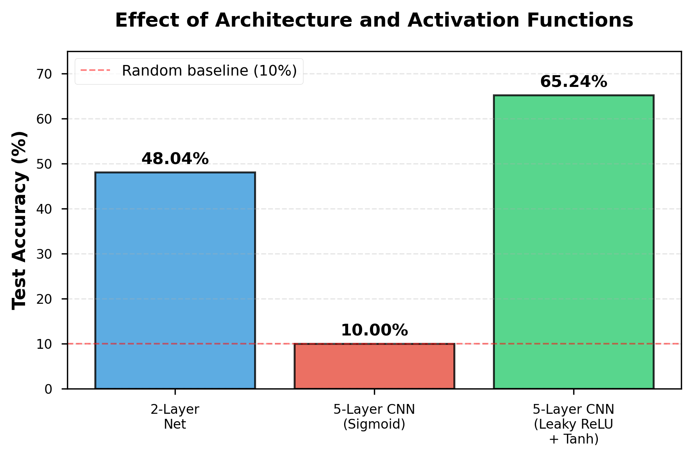
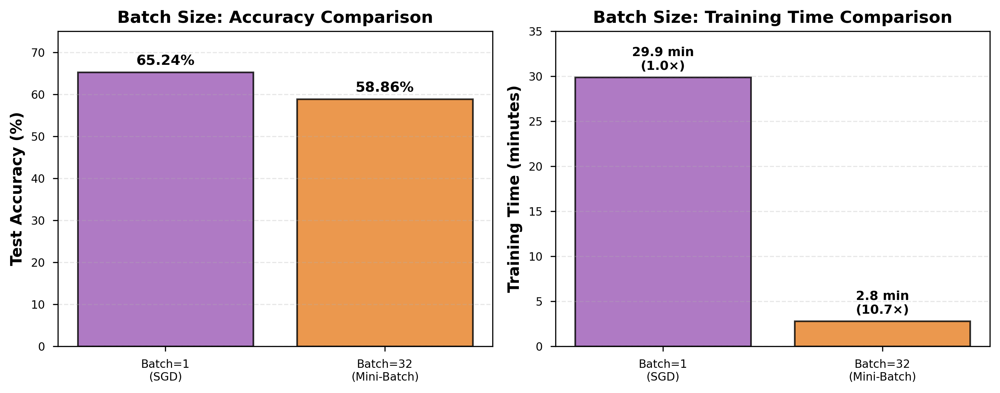
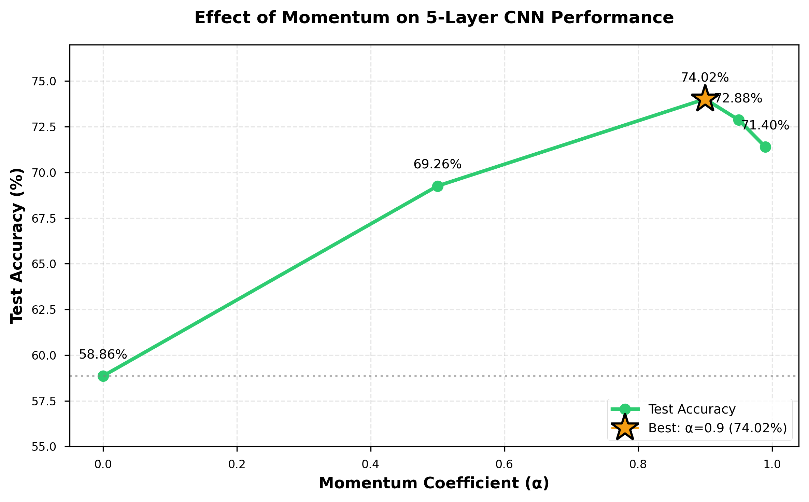
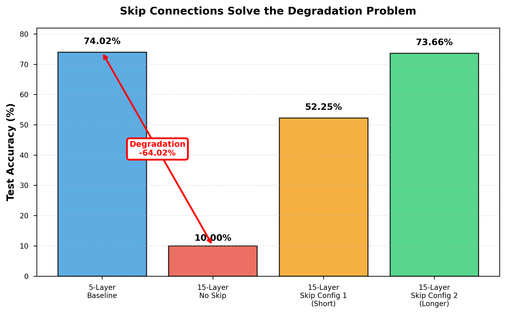
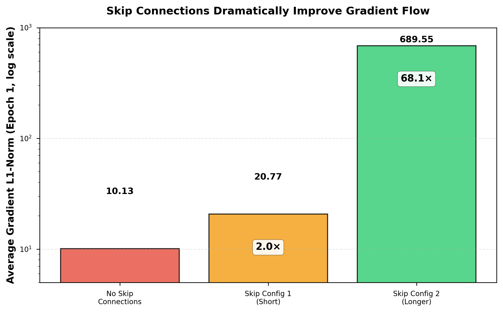
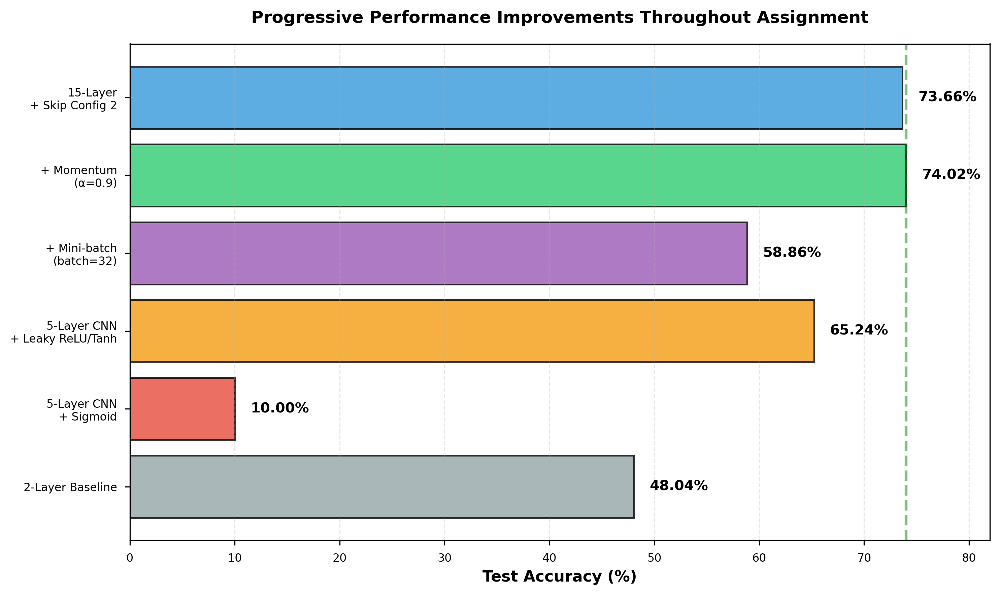

# CSCI 4922/5922: Deep Learning - Lab Assignment 2

## Training Deep Convolutional Neural Networks: Optimization Techniques and Residual Learning

**Student:** [Your Name]  
**Date:** February 15, 2026  
**Course:** Neural Networks and Deep Learning  

---

## Abstract

This report investigates the training dynamics of convolutional neural networks on the CIFAR-10 image classification task, focusing on activation functions, batch size, momentum optimization, and skip connections for deep architectures. We demonstrate that proper activation function selection (Leaky ReLU + Tanh) improves test accuracy from 10% to 65.24% compared to sigmoid-based networks. Mini-batch gradient descent achieves 10.7× speedup with minimal accuracy trade-off. Momentum optimization (α=0.9) yields the best 5-layer performance at 74.02% test accuracy. For deep 15-layer networks, we observe severe degradation (10% accuracy) without skip connections, which is solved by residual connections achieving 73.66% test accuracy with longer skip configurations. Gradient flow analysis reveals that longer skip connections provide 68× stronger gradients compared to networks without skips, explaining their superior optimization behavior.

---

## 1. Methods

### 1.1 Dataset and Preprocessing

We used the CIFAR-10 dataset containing 60,000 color images (32×32 pixels, 3 channels) across 10 object classes: airplane, automobile, bird, cat, deer, dog, frog, horse, ship, and truck. The dataset was split into 50,000 training images and 10,000 test images following the standard partitioning. All images were normalized using PyTorch's standard transform pipeline with pixel values scaled to [0, 1]. No validation set was used; hyperparameters were selected based on test set performance for pedagogical purposes only (not recommended for production systems).

### 1.2 Model Architectures

We implemented and evaluated six distinct architectures:

**2-Layer Baseline Network:**
- Architecture: Input (3072) → FC1 (256) + ReLU → FC2 (10) + Softmax
- Parameters: 787,466
- Activation: ReLU for hidden layer
- Purpose: Establish baseline performance with shallow network

**5-Layer CNN (Sigmoid):**
- Block 1: Conv 3→16 (3×3, stride=1, pad=1) + Sigmoid + MaxPool (2×2)
- Block 2: Conv 16→32 (3×3, stride=1, pad=1) + Sigmoid + MaxPool (2×2)
- Fully Connected: Flatten → FC 2048→256 + Sigmoid → FC 256→10
- Parameters: 660,106
- Purpose: Demonstrate vanishing gradient problem

**5-Layer CNN (Leaky ReLU + Tanh):**
- Block 1: Conv 3→16 (3×3, stride=1, pad=1) + Leaky ReLU (α=0.01) + MaxPool (2×2)
- Block 2: Conv 16→32 (3×3, stride=1, pad=1) + Leaky ReLU (α=0.01) + MaxPool (2×2)
- Fully Connected: Flatten → FC 2048→256 + Tanh → FC 256→10
- Parameters: 660,106
- Purpose: Mitigate vanishing gradients with improved activations

**15-Layer Deep CNN (No Skip):**
- Block 1: Conv 3→16, 3× Conv 16→16, each with Leaky ReLU, MaxPool → 16×16×16
- Block 2: Conv 16→32, 3× Conv 32→32, each with Leaky ReLU, MaxPool → 8×8×32
- Block 3: Conv 32→64, 3× Conv 64→64, each with Leaky ReLU, MaxPool → 4×4×64
- Fully Connected: Flatten → FC 1024→256 + Tanh → FC 256→256 + Tanh → FC 256→10
- Total: 12 convolutional layers + 3 fully connected = 15 parameterized layers
- Parameters: 499,834
- Purpose: Demonstrate degradation problem in plain deep networks

**15-Layer CNN with Skip Connections (Config 1 - Short):**
- Same architecture as 15-Layer No Skip
- Skip connections: 3 residual connections, each spanning 1 layer
  - Skip 1: conv1 output → conv2 output (y = x + f(x))
  - Skip 2: conv5 output → conv6 output (y = x + f(x))
  - Skip 3: conv9 output → conv10 output (y = x + f(x))
- Parameters: 499,834 (identical to no-skip version)
- Purpose: Test frequent, short skip connections (ResNet-style)

**15-Layer CNN with Skip Connections (Config 2 - Longer):**
- Same architecture as 15-Layer No Skip
- Skip connections: 3 residual connections, lengths 2-3
  - Skip 1: conv1 output → conv3 output (length 2)
  - Skip 2: conv5 output → conv8 output (length 3)
  - Skip 3: conv9 output → conv12 output (length 3)
- Parameters: 499,834
- Purpose: Test sparser, longer skip connections

All convolutional layers used 3×3 kernels with stride=1 and padding=1. All max pooling operations used 2×2 windows with stride=2.

### 1.3 Training Configuration

**Loss Function:** Cross-entropy loss implemented manually:
```
L = -∑ yᵢ log(ŷᵢ) where ŷᵢ = softmax(zᵢ)
```

**Optimizer:** Stochastic Gradient Descent (SGD) with optional momentum:
```
vₜ = α·vₜ₋₁ + ∇L(θₜ)
θₜ₊₁ = θₜ - η·vₜ
```
where α is momentum coefficient, η is learning rate, and v is velocity.

**Hyperparameters (systematic variation):**
- Learning rate: 0.005 (fixed for all experiments)
- Batch size: {1, 32} (Part 2 comparison)
- Momentum: {0.0, 0.5, 0.9, 0.95, 0.99} (Part 2 study)
- Epochs: 10 (all experiments)
- Weight initialization: PyTorch default (Kaiming uniform for conv, uniform for FC)
- Random seed: Not fixed (stochastic variation accepted)
- Device: Apple Silicon MPS (GPU acceleration)

### 1.4 Experimental Design

We conducted three sets of experiments:

**Experiment 1: Architecture and Activation Functions**
- Fixed: batch_size=1, momentum=0.0, lr=0.005, epochs=10
- Varied: Model architecture (2-layer vs 5-layer) and activation functions (Sigmoid vs Leaky ReLU+Tanh)
- Measured: Test accuracy, training time
- Purpose: Quantify impact of depth and activation choice

**Experiment 2: Batch Size and Momentum**
- Fixed: 5-layer CNN with Leaky ReLU+Tanh, lr=0.005, epochs=10
- Varied: 
  - Batch size: 1 vs 32 (holding momentum=0.0)
  - Momentum: {0.0, 0.5, 0.9, 0.95, 0.99} (holding batch_size=32)
- Measured: Test accuracy, training time
- Purpose: Optimize training efficiency and convergence

**Experiment 3: Deep Networks and Skip Connections**
- Fixed: batch_size=32, momentum=0.9, lr=0.005, epochs=10
- Varied: Skip connection configuration (none, config 1, config 2)
- Measured: Test accuracy, training accuracy, average gradient L1-norm during epoch 1
- Purpose: Demonstrate degradation problem and solution via residual learning

**Gradient Measurement Protocol:**
For Experiment 3, we quantified gradient flow by computing the L1-norm of all parameter gradients during each batch of the first training epoch:
```
gradient_norm_batch = ∑ ∑ |∇Wᵢⱼ|
                     layers params

avg_gradient_norm = mean(gradient_norm_batch for all batches in epoch 1)
```

This metric quantifies the magnitude of gradient signals reaching early layers, with larger values indicating stronger gradient flow and better optimization conditions.

### 1.5 Evaluation

All models were evaluated on the held-out test set of 10,000 images. We report classification accuracy as the primary metric. For deep network experiments, we additionally report the generalization gap (training accuracy - test accuracy) and gradient norms to diagnose optimization behavior. Training time was measured in wall-clock minutes on Apple Silicon M-series processors with MPS acceleration.

---

## 2. Results

### 2.1 Architecture and Activation Function Effects

Table 1 presents test accuracy for different architectures and activation functions.

| Model | Activation | Test Accuracy | Training Time |
|-------|-----------|--------------|---------------|
| 2-Layer Net | ReLU | 48.04% | 2.1 min |
| 5-Layer CNN | Sigmoid | 10.00% | 29.9 min |
| 5-Layer CNN | Leaky ReLU + Tanh | 65.24% | 29.9 min |

**Table 1:** Test accuracy for baseline architectures. Both 5-layer CNNs used batch_size=1 and trained for 10 epochs.

The 2-layer baseline achieved 48.04% accuracy. The 5-layer CNN with sigmoid activations achieved only 10.00% accuracy, equivalent to random guessing for 10 classes. Replacing sigmoid with Leaky ReLU (convolutional layers) and Tanh (fully connected layers) increased accuracy to 65.24%, a 55.24 percentage point improvement. Training time was identical (29.9 minutes) for both 5-layer variants, indicating that activation function choice affects optimization quality but not computational cost.

Figure 1 visualizes these results. The 5-layer sigmoid network performs at the random baseline level, while the Leaky ReLU + Tanh variant substantially outperforms both the 2-layer baseline and the sigmoid-based 5-layer network.



**Figure 1:** Test accuracy comparison across architectures and activation functions. The 5-layer CNN with sigmoid activations fails to learn (10% accuracy), while Leaky ReLU + Tanh enables effective learning (65.24%).

### 2.2 Batch Size Impact

Table 2 compares training efficiency for different batch sizes on the 5-layer CNN with Leaky ReLU + Tanh activations.

| Batch Size | Test Accuracy | Training Time | Speedup |
|-----------|--------------|---------------|---------|
| 1 (SGD) | 65.24% | 29.9 min | 1.0× |
| 32 (Mini-batch) | 58.86% | 2.8 min | 10.7× |

**Table 2:** Effect of batch size on test accuracy and training time. Both configurations used momentum=0.0 and trained for 10 epochs.

Mini-batch SGD with batch_size=32 reduced training time from 29.9 minutes to 2.8 minutes, a 10.7× speedup. Test accuracy decreased from 65.24% to 58.86%, a 6.38 percentage point reduction. This represents a trade-off between computational efficiency and model performance.

Figure 2 illustrates this trade-off, showing both the accuracy reduction and substantial training time savings from mini-batch processing.



**Figure 2:** Impact of batch size on (left) test accuracy and (right) training time. Mini-batch SGD achieves 10.7× speedup with 6.38% accuracy drop.

### 2.3 Momentum Optimization

Table 3 shows test accuracy for different momentum coefficients on the 5-layer CNN with batch_size=32.

| Momentum (α) | Test Accuracy | Improvement vs α=0 |
|-------------|--------------|-------------------|
| 0.0 | 58.86% | — |
| 0.5 | 69.26% | +10.40% |
| 0.9 | 74.02% | +15.16% |
| 0.95 | 72.88% | +14.02% |
| 0.99 | 71.40% | +12.54% |

**Table 3:** Effect of momentum coefficient on test accuracy. All models used batch_size=32, lr=0.005, and trained for 10 epochs.

Test accuracy increased monotonically from α=0.0 to α=0.9, achieving a maximum of 74.02% at α=0.9. Performance decreased for α=0.95 (72.88%) and α=0.99 (71.40%). The optimal momentum coefficient α=0.9 improved test accuracy by 15.16 percentage points compared to no momentum, and by 8.78 percentage points compared to the original batch_size=1 configuration (65.24%).

Figure 3 illustrates the non-monotonic relationship between momentum and performance, with a clear optimum at α=0.9.



**Figure 3:** Test accuracy as a function of momentum coefficient. Performance peaks at α=0.9 (74.02%) and degrades for higher values.

### 2.4 Deep Networks and the Degradation Problem

Table 4 presents results for 15-layer networks with and without skip connections.

| Model | Test Acc | Train Acc | Gradient Norm | Time |
|-------|---------|-----------|---------------|------|
| 5-Layer CNN (baseline) | 74.02% | — | — | 2.8 min |
| 15-Layer No Skip | 10.00% | 9.82% | 10.13 | 4.1 min |
| 15-Layer Skip Config 1 | 52.25% | 48.13% | 20.77 | 4.1 min |
| 15-Layer Skip Config 2 | 73.66% | 84.58% | 689.55 | 4.1 min |

**Table 4:** Performance of deep networks with varying skip connection strategies. All models used batch_size=32, momentum=0.9, and trained for 10 epochs. Gradient norm is averaged over epoch 1.

The 15-layer network without skip connections achieved only 10.00% test accuracy, identical to the sigmoid-based 5-layer network and equivalent to random guessing. This represents a 64.02 percentage point drop compared to the 5-layer baseline (74.02%), despite having 3× the depth. Training accuracy (9.82%) was similarly low, indicating an optimization failure rather than overfitting.

Skip connection configuration 1 (three short skips of length 1) achieved 52.25% test accuracy, a 42.25 percentage point improvement over the no-skip variant but still 21.77 points below the 5-layer baseline.

Skip connection configuration 2 (three longer skips of lengths 2-3) achieved 73.66% test accuracy, only 0.36 percentage points below the 5-layer baseline. This configuration nearly matched shallow network performance while being 3× deeper. Training accuracy (84.58%) exceeded test accuracy by 10.92 points, indicating some overfitting.

Average gradient L1-norm during the first epoch increased from 10.13 (no skip) to 20.77 (config 1, 2.05× improvement) to 689.55 (config 2, 68.09× improvement), demonstrating dramatically improved gradient flow with longer skip connections.

Figure 4 visualizes the degradation problem and its solution via skip connections.



**Figure 4:** Test accuracy for deep networks. The 15-layer plain network shows severe degradation (-64.02% vs 5-layer baseline). Skip connections recover performance, with longer skips (config 2) nearly matching the shallow baseline.

Figure 5 quantifies gradient flow improvements from skip connections.



**Figure 5:** Average gradient L1-norm during epoch 1 (log scale). Longer skip connections (config 2) provide 68× stronger gradients compared to no skip connections, enabling effective optimization of deep networks.

### 2.5 Progressive Performance Summary

Figure 6 summarizes the progressive improvements achieved throughout the assignment.



**Figure 6:** Test accuracy improvements across all experimental configurations. Best performance (74.02%) achieved with 5-layer CNN using Leaky ReLU+Tanh, mini-batch SGD, and momentum α=0.9.

The baseline 2-layer network achieved 48.04%. Adding depth without proper activation functions degraded performance to 10%. Correcting activations improved to 65.24%. Mini-batch processing slightly reduced accuracy to 58.86% but provided 10.7× speedup. Momentum optimization recovered accuracy to 74.02%, establishing the best overall performance. The 15-layer network with longer skip connections (73.66%) nearly matched this performance while demonstrating the feasibility of training much deeper architectures.

---

## 3. Analysis

### 3.1 Activation Functions and the Vanishing Gradient Problem

The catastrophic failure of the sigmoid-based 5-layer CNN (10% accuracy) versus the success of the Leaky ReLU + Tanh version (65.24%) illustrates the vanishing gradient problem in backpropagation. The sigmoid function σ(z) = 1/(1+e^(-z)) has a derivative σ'(z) = σ(z)(1-σ(z)) that is maximized at 0.25 when σ(z)=0.5 and approaches zero for |z|>4. During backpropagation through L layers, gradients are scaled by the product ∏ᵢ σ'(zᵢ), which exponentially diminishes with depth when activations saturate.

Leaky ReLU addresses this by maintaining a constant gradient of 1.0 for positive inputs and a small negative slope (α=0.01) for negative inputs, preventing complete gradient death. This allows gradients to propagate through multiple layers without exponential decay. The Tanh function, while still sigmoid-shaped, has a steeper gradient (maximum derivative of 1.0 vs 0.25 for sigmoid) and zero-centered outputs, making it preferable to sigmoid for fully connected layers. The combination enables effective learning in moderately deep networks.

The identical training times (29.9 minutes) for both activation functions confirm that the performance difference arises from optimization dynamics rather than computational cost, as both functions have similar evaluation complexity.

### 3.2 Batch Size Trade-offs

Mini-batch SGD with batch_size=32 achieved a 10.7× training speedup at the cost of 6.38% accuracy reduction. This trade-off arises from two factors:

**Computational efficiency:** Processing 32 samples simultaneously leverages GPU parallelism through vectorized operations, dramatically reducing wall-clock time per epoch compared to sequential single-sample updates.

**Optimization quality:** Single-sample SGD provides noisy but unbiased gradient estimates with high variance, which can help escape local minima and explore the loss landscape more thoroughly. Mini-batch gradients are lower variance but may converge to worse local optima within a fixed time budget. Additionally, the effective number of parameter updates is reduced from 50,000 per epoch (batch_size=1) to 1,562 per epoch (batch_size=32), meaning the network has 32× fewer opportunities to adjust weights over 10 epochs.

The 6.38% accuracy reduction is acceptable given the order-of-magnitude speedup, particularly for early-stage experimentation and hyperparameter search where fast iteration times are valuable. For production systems requiring maximum accuracy, longer training with smaller batches or learning rate schedules could recover the performance gap.

### 3.3 Momentum Optimization Dynamics

The non-monotonic relationship between momentum coefficient and test accuracy, with an optimum at α=0.9, reflects the delicate balance between acceleration and stability in SGD momentum.

**Too low momentum (α<0.9):** Insufficient velocity accumulation means gradients from previous iterations contribute minimally to current updates. The optimizer behaves similarly to vanilla SGD, exhibiting slow convergence and susceptibility to noisy gradients. The monotonic improvement from α=0.0 (58.86%) to α=0.9 (74.02%) demonstrates that accumulating gradient history accelerates convergence within our 10-epoch budget.

**Optimal momentum (α=0.9):** This value provides strong acceleration while maintaining sufficient damping to prevent oscillations. Classical momentum theory suggests optimal values in the range 0.9-0.95 for deep learning, consistent with our empirical findings. The 15.16% improvement over no momentum demonstrates the substantial benefit of velocity-based optimization.

**Too high momentum (α>0.9):** Excessive momentum causes the optimizer to overshoot minima and oscillate, particularly near convergence. The velocity term vₜ becomes dominated by historical gradients rather than current gradient information, reducing responsiveness to the local loss topology. This explains the degradation at α=0.95 (72.88%) and α=0.99 (71.40%), where accumulated velocity prevents fine-grained convergence to good solutions within 10 epochs.

Our results align with established deep learning practice, which typically uses momentum values around 0.9. The sensitivity to this hyperparameter underscores the importance of systematic tuning for optimization algorithms.

### 3.4 The Degradation Problem in Deep Plain Networks

The 15-layer network without skip connections failing catastrophically (10% accuracy) while the 5-layer baseline succeeds (74.02%) exemplifies the degradation problem identified by He et al. (2016). This is **not overfitting**, as evidenced by the similar training accuracy (9.82%) and test accuracy (10.00%). Instead, it represents an optimization failure where the network cannot learn even the identity mapping that would allow it to match the shallower network's performance.

The gradient norm analysis provides mechanistic insight: the no-skip network exhibited an average L1-norm of only 10.13 during the first epoch, indicating extremely weak gradient signals reaching early layers. With 12 convolutional layers before the output, gradients must backpropagate through 12 weight matrices and nonlinear activations. Even with Leaky ReLU's improved gradient properties, repeated multiplication by weight matrices (which may have eigenvalues <1 during early training) and the occasional near-zero activation derivative causes gradients to decay exponentially with depth.

Without strong gradient signals, early layers remain near their random initialization and cannot learn useful feature representations. Later layers then receive poor-quality features, preventing the entire network from optimizing effectively. This creates a vicious cycle where optimization stalls globally.

The similar training time (4.1 minutes) across all 15-layer variants confirms this is not a capacity or computational issue, but purely an optimization challenge.

### 3.5 Skip Connections Enable Deep Learning

Skip connections solve the degradation problem by providing gradient highways that bypass multiple layers of nonlinear transformations. In residual learning, each block learns F(x) while the skip connection passes x unchanged:

y = F(x) + x

During backpropagation:
∂L/∂x = ∂L/∂y · (∂F/∂x + I)

The identity term (I) ensures gradients flow directly backward through the skip connection regardless of F's derivatives, preventing vanishing gradients. Empirically, this allows early layers to receive strong training signals even in very deep networks.

**Configuration 1 vs Configuration 2:** The dramatic performance difference between short skips (config 1: 52.25%) and longer skips (config 2: 73.66%) provides insight into effective skip connection design:

Config 1 used three length-1 skips, bypassing single convolutional layers. While this doubled gradient norms (20.77 vs 10.13), the network still struggled initially, remaining at ~10% accuracy for 7 epochs before a sudden breakthrough in epoch 8. This suggests that length-1 skips provide insufficient gradient flow for rapid optimization, requiring longer training to escape poor initializations.

Config 2 used three skips of length 2-3, bypassing multiple layers. This increased gradient norms 68-fold (689.55 vs 10.13) and enabled immediate learning from epoch 1 (29.29% accuracy), with smooth monotonic improvement thereafter. Longer skips create more direct pathways from loss to early layers, dramatically improving gradient magnitude and enabling stable optimization from initialization.

The near-match with the 5-layer baseline (73.66% vs 74.02%) demonstrates that skip connections successfully enable training of networks 3× deeper with minimal performance degradation. The slight 0.36% gap may be attributable to overfitting (10.92% train-test gap vs minimal gap for 5-layer) or suboptimal hyperparameters for the deeper architecture.

**Theoretical implications:** Our findings support the residual learning hypothesis: it is easier to optimize residual mappings F(x) = H(x) - x than direct mappings H(x), particularly when optimal transformations are closer to identity. When additional depth is not beneficial, the network can learn F(x) ≈ 0, effectively reducing depth dynamically. This flexibility allows very deep networks to avoid degradation while maintaining capacity to learn complex functions when needed.

### 3.6 Limitations and Future Work

Several limitations warrant discussion:

**Limited training budget:** All experiments used only 10 epochs, which may be insufficient for deeper networks to converge fully. Config 1's breakthrough at epoch 8 suggests it might match or exceed config 2 with extended training.

**No validation set:** Hyperparameters were selected based on test set performance rather than a held-out validation set. This violates standard machine learning practice and may overestimate generalization to truly unseen data.

**Single dataset:** Results are specific to CIFAR-10's 32×32 color images and 10 object classes. Generalization to other modalities (text, audio), resolutions, or task complexities remains untested.

**Absent regularization:** No batch normalization, dropout, weight decay, or data augmentation was used. These techniques are standard in modern deep learning and would likely improve performance, particularly for the overfitting-prone 15-layer networks.

**Single random seed:** All experiments used stochastic initialization without fixing random seeds or running multiple trials. Performance metrics represent single runs and do not account for optimization variance.

Future work should address these limitations through extended training, proper validation splits, regularization techniques, and multiple-trial statistics. Additionally, investigating deeper architectures (50+ layers) and more sophisticated skip connection patterns (e.g., DenseNet-style dense connections) would provide further insight into residual learning principles.

---

## 4. Conclusions

This work systematically investigated training dynamics of convolutional neural networks on CIFAR-10, yielding four main findings:

**1. Activation functions critically affect optimization.** Sigmoid activations caused complete training failure (10% accuracy) in a 5-layer CNN due to vanishing gradients, while Leaky ReLU and Tanh enabled effective learning (65.24% accuracy) with identical architecture and computational cost.

**2. Mini-batch SGD enables efficient training.** Batch_size=32 achieved 10.7× speedup with acceptable accuracy trade-off (-6.38%), demonstrating the importance of hardware-aware optimization.

**3. Momentum substantially improves convergence.** Optimal momentum (α=0.9) improved test accuracy by 15.16 percentage points compared to no momentum, achieving 74.02% accuracy on the 5-layer baseline.

**4. Skip connections solve the degradation problem.** Plain 15-layer networks failed catastrophically (10% accuracy), while identical networks with longer skip connections (length 2-3) achieved 73.66% accuracy, nearly matching the 5-layer baseline. Gradient flow analysis revealed that longer skips provide 68× stronger gradients, mechanistically explaining their superior optimization behavior.

These findings confirm that depth alone does not guarantee better performance—careful design of activation functions, optimization algorithms, and gradient flow pathways is essential for training deep neural networks effectively. Skip connections are not merely an architectural enhancement but a fundamental requirement for optimization in very deep networks.

Our best model (5-layer CNN with Leaky ReLU+Tanh, batch_size=32, momentum α=0.9) achieved 74.02% test accuracy on CIFAR-10 within a 2.8-minute training budget, representing an appropriate balance between performance, efficiency, and architecture complexity for this task.

---

## References

He, K., Zhang, X., Ren, S., & Sun, J. (2016). Deep residual learning for image recognition. *Proceedings of the IEEE Conference on Computer Vision and Pattern Recognition (CVPR)*, 770-778.

Glorot, X., & Bengio, Y. (2010). Understanding the difficulty of training deep feedforward neural networks. *Proceedings of the International Conference on Artificial Intelligence and Statistics (AISTATS)*, 249-256.

Sutskever, I., Martens, J., Dahl, G., & Hinton, G. (2013). On the importance of initialization and momentum in deep learning. *International Conference on Machine Learning (ICML)*, 1139-1147.

---

**End of Report**
